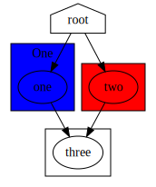

# Graphviz

| `develop` |
|-----------|
| [](https://codecov.io/gh/Innmind/Graphviz) |
| [](https://github.com/Innmind/Graphviz/actions?query=workflow%3ACI) |

Graphviz model to help build graphs. This model goal is to express the possibilities offered by Graphviz (though note that all features are not implemented).

## Installation

```sh
composer require innmind/graphviz
```

## Usage

```php
use Innmind\Graphviz\{
    Layout\Dot,
    Graph\Graph,
    Node\Node,
    Node\Shape,
};
use Innmind\Url\Url;
use Innmind\Colour\Colour;
use Innmind\Server\Control\{
    ServerFactory,
    Server\Command,
};

$dot = new Dot;
$graph = Graph::directed();
$clusterOne = Graph::directed('one');
$clusterOne->target(Url::of('http://example.com'));
$clusterOne->displayAs('One');
$clusterOne->fillWithColor(Colour::of('blue'));
$clusterOne->add(Node::named('one'));
$clusterTwo = Graph::directed('two');
$clusterTwo->fillWithColor(Colour::of('red'));
$clusterTwo->add(Node::named('two'));
$clusterThree = Graph::directed('three');
$clusterThree->add($three = Node::named('three'));

//important to not reuse nodes added in clusters otherwise clusters boundaries
//will be messed up
$root = Node::named('root');
$root->shaped(Shape::house());
$root->linkedTo($one = Node::named('one'));
$root->linkedTo($two = Node::named('two'));
$one->linkedTo($three);
$two->linkedTo($three);

$graph->add($root);
$graph->cluster($clusterOne);
$graph->cluster($clusterTwo);
$graph->cluster($clusterThree);

$output = $dot($graph);

(new ServerFactory)
    ->make()
    ->processes()
    ->execute(
        Command::foreground('dot')
            ->withShortOption('Tsvg')
            ->withShortOption('o', 'graph.svg')
            ->withInput($output),
    )
    ->wait();
```

This example will produce the given svg file: ([source](graph.dot))


